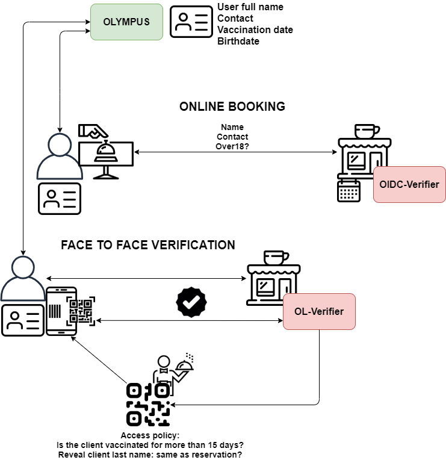
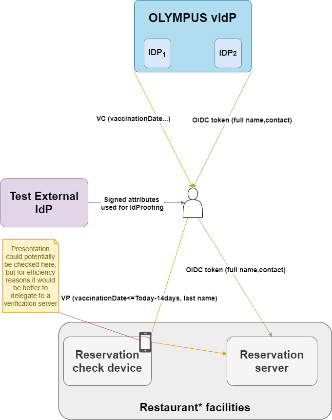

# Use case 

We designed a use case for testing the OLYMPUS framework. The main goal
was a generic but relevant use case that allows the demonstration of the
functionality of the OLYMPUS framework, focusing on the aspects that
were not completely covered in the two application use cases of the
project. In particular, the main interests have been: W3C Verifiable
Credential specification for serialization in the p-ABC approach,
Multi-Factor Authentication, and the OIDC flow. As a side-effect, this
use case shows the flexibility and interoperability of the OLYMPUS
identity management system.

## Scenario description 

The use case establishes the OLYMPUS vIdP as a general-purpose
authentication tool, with commonly needed attributes like name, date of
birth, phone/email of contact... (and more specific to the current
situation, COVID vaccination date). Users can take advantage of this
tool in a user-friendly manner in two ways: online (from home PC) and
in-person (using a mobile phone application). In both cases, the tool
can easily be adopted by any relying party that wishes to do so. In the
former, the relying party will simply use the OLYMPUS vIdP as an OIDC
provider. In the latter, the relying party will need a server that has
the OLYMPUS verification library and start the presentation process by
having the user scan a QR code.

**The specific scenario.** To particularize, we use those generic tools
to book and attend a venue (e.g., a restaurant). In this case, an online
reservation previous to attending is needed. Once we arrive at the
venue, there is an extra policy check: the user needs to show that the
name corresponds to the person that made the reservation, as well as
that he/she was vaccinated at least 14 days prior.

## Components 

The components involved in the scenario are:

-   **OLYMPUS vIdP:** Provides privacy-preserving identity management to
    users, while still giving relying parties the security they need on
    the presented information. Supports both online authentication
    following the OIDC flow and issuance of p-ABCs (serialized following
    W3C’s Verifiable Credentials specification) for “offline”
    interactions. Optionally (as identity proving is not the focus of
    the use case), an external service will play the role of third-party
    identity provider for user enrolment in the vIdP.

-   **User side:** Two tools, one for each approach, are needed. A
    mobile application for p-ABC presentations (“offline”), and a OIDC
    OLYMPUS client for online interactions (in the future, simply a
    browser plugin).

-   **Relying-party side:** In this case, there is a single “service
    provider” (the restaurant/venue). However, it would act differently
    depending on the specific flow. For the online interaction a
    standard OIDC implementation is needed. For the offline interaction,
    the service provider can rely on the OLYMPUS verification library to
    validate the p-ABC presentation.

## Flows 

While the scenario involves a single overarching flow (booking and
making use of a service), it can be divided into two separate
sub-processes.

### Online reservation

Users can create a reservation to their name using the OIDC flow for
authentication.

1.  User select login with OLYMPUS in the service provider
    (restaurant/venue) webpage

2.  The OLYMPUS login screen requests username and password

3.  After login, an OIDC token with the requested attributes is
    generated

4.  The service provider verifies the token and grants access/confirms
    the reservation

Advantages of using OIDC for this operation: Users are accustomed to
OIDC (and similar) flows when browsing in the web. It is easy to use and
understand. Also, this step is much faster/more efficient than the
credential approach.

### In-person check-in

Users can rely on the application to prove necessary predicates to make
use of their reservation.

1.  User selects the option for getting a new credential and performs a
    login process (which may involve two factor authentication). This
    step may be done in advance, as the credential will be safely stored
    during its lifetime

2.  User uses the app to scan the QR presented by the service provider

3.  The app uses the result to retrieve the policy asked and shows it to
    the user

4.  If the user accepts, a presentation for that policy is generated and
    sent to the service provider

5.  The service provider verifies the validity of the presentation

Advantages of using Verifiable Credentials for this operation: Offline
authentication is possible while avoiding physical ids and the privacy
problems that come from them. Also, the application is easy to use, and
it is simpler for users to understand the usage of Credentials with
their phone.

### OLYMPUS account management

During the previous processes, optional steps can be taken by the user
to modify its account in OLYMPUS.

In the **online (web-browser)** reservation, when the user is in the
OLYMPUS login screen (step 2), he/she can start a registration process.
In our specific scenario, for simplicity (as it is not a goal to test
the identity proving functionality), the user will simply input the
attributes that will be added to his/her account.

When performing login from the **Android application**, the user can opt
to add a Multi-Factor-Authentication method (in our specific scenario,
based on Google Authenticator). The process will involve introducing
user and password of the OLYMPUS account, adding the generated shared
secret to the desired MFA authenticator (e.g., Google Authenticator app)
and confirming the choice by inputting the TOTP generated by the
authenticator.

